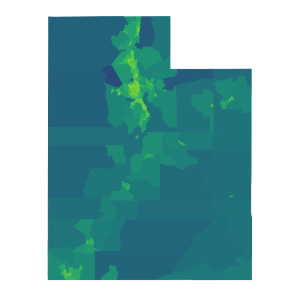

## Get some population data for Utah


```r
library(tidyverse)
library(tidycensus)
library(sf)

options(tigris_use_cache = TRUE)

utah_raw <- get_acs(state = "UT", 
                    geography = "tract", 
                    variables = "B01003_001",  
                    geometry = TRUE)
```

```
## Getting data from the 2012-2016 5-year ACS
```

```
## Using FIPS code '49' for state 'UT'
```

```r
area <- utah_raw %>% 
    select(geometry) %>% 
    st_area() %>%
    as.numeric()

utah <- bind_cols(utah_raw, data_frame(area = area))

head(utah)
```

```
## Simple feature collection with 6 features and 6 fields
## geometry type:  POLYGON
## dimension:      XY
## bbox:           xmin: -114.0505 ymin: 38.14742 xmax: -111.9994 ymax: 42.00122
## epsg (SRID):    4269
## proj4string:    +proj=longlat +datum=NAD83 +no_defs
##         GEOID                                      NAME   variable
## 1 49001100100    Census Tract 1001, Beaver County, Utah B01003_001
## 2 49001100200    Census Tract 1002, Beaver County, Utah B01003_001
## 3 49003960100 Census Tract 9601, Box Elder County, Utah B01003_001
## 4 49003960200 Census Tract 9602, Box Elder County, Utah B01003_001
## 5 49003960300 Census Tract 9603, Box Elder County, Utah B01003_001
## 6 49003960400 Census Tract 9604, Box Elder County, Utah B01003_001
##   estimate moe                       geometry        area
## 1     3517 200 POLYGON ((-112.7899 38.3158...  1354789013
## 2     2920 200 POLYGON ((-114.0505 38.4999...  5341852992
## 3     2879 267 POLYGON ((-114.0426 41.2109... 15814285565
## 4     7167 383 POLYGON ((-112.1949 41.7257...   260192460
## 5     8905 438 POLYGON ((-112.2323 41.7223...    35855445
## 6     4628 253 POLYGON ((-112.4894 41.6044...   759753941
```


```r
library(viridis)
library(hexSticker)

ut <- utah %>%
    ggplot(aes(fill = log2((estimate + 25) / area), 
               color = log2((estimate + 25) / area))) + 
    geom_sf() + 
    scale_fill_viridis(begin=.3, end=.9) + 
    scale_color_viridis(begin=.3, end=.9) + 
    theme_minimal() +
    theme(legend.position="none") +
    theme(axis.text.x=element_blank(),
          axis.text.y=element_blank(),
          panel.grid.major = element_line(colour = "transparent")) +
    theme_transparent()

ut
```



```r
sysfonts::font_add_google("Baloo Tammudu", "baloo")

sticker(ut,
        package = "slc rug", 
        p_size = 12.5,
        p_y = 1,
        p_family = "baloo",
        p_color = "#ffffff",
        h_fill = "#453781FF",
        h_color = "#ffffff",
        h_size = 2,
        s_x = 1, s_y = 1, 
        s_width = 1.6, s_height = 1.6,
        url = "github.com/slc-rug",
        u_color	= "#ffffff",
        u_size = 1.2,
        filename="slcrug_hex.png")
```


